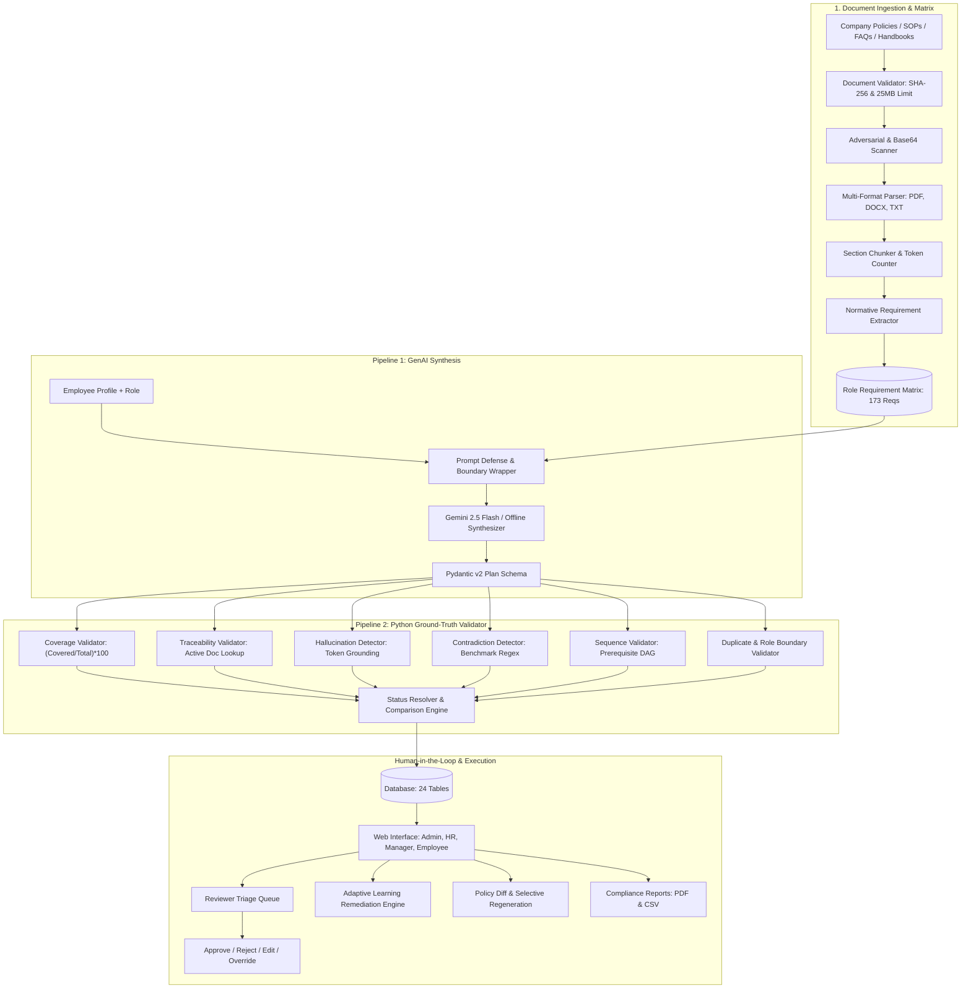

# SkillSprint AI: Enterprise Onboarding Intelligence Platform

[](https://www.python.org/)
[](https://fastapi.tiangolo.com/)
[](https://www.sqlite.org/)
[](https://www.reportlab.com/)
[](https://pytest.org/)
[]()

> **Primary Architectural Contract:** `LLM ≠ Ground Truth`.  
> Generative AI proposes personalized curricula, modules, and quizzes (Pipeline 1), while an independent, deterministic Python validation engine (Pipeline 2) calculates mandatory requirement coverage, verifies active source document traceability, eliminates hallucinations via token grounding, enforces strict policy precedence, and resolves conflicts without trusting model output.

---

## Table of Contents
1. [Executive Summary](#executive-summary)
2. [Dual-Pipeline Architecture](#dual-pipeline-architecture)
3. [Key Features & Capabilities](#key-features--capabilities)
4. [Dataset & Corporate Corpus (ApexNova Global)](#dataset--corporate-corpus-apexnova-global)
5. [Quickstart & Installation](#quickstart--installation)
6. [Running the Application](#running-the-application)
7. [Running the Test Suite](#running-the-test-suite)
8. [REST API Documentation](#rest-api-documentation)
9. [UI Perspectives & Navigation](#ui-perspectives--navigation)
10. [Policy Impact & Selective Regeneration](#policy-impact--selective-regeneration)
11. [Deliverables Directory](#deliverables-directory)

---

## Executive Summary
SkillSprint AI was engineered specifically for the **TechWiz 7 Competition (Theme: OnboardVerse, Category: Generative AI PowerPlay)** adhering strictly to SRS v1.0. Traditional enterprise onboarding systems either rely on static, unengaging LMS checklists or naively entrust generative AI to grade employees and dictate compliance policies—resulting in hallucinations, outdated standard dissemination, and audit failure.

SkillSprint AI solves this challenge through a **Dual-Pipeline Architectural Contract**:
- **Pipeline 1 (GenAI Generation Pipeline):** Leverages Google Gemini 2.5 Flash (with offline deterministic synthesis fallback) to generate personalized 90-day onboarding roadmaps, interactive learning modules, hands-on scenario assessments, and auto-graded quizzes grounded in actual company documents.
- **Pipeline 2 (Deterministic Ground-Truth Validation Pipeline):** Pure Python rule engine that programmatically validates every generated entity against the SQLite database truth table, enforcing $100\%$ mandatory coverage, authentic section citations, 0% contradiction tolerance, and topological sequence validity.

---

## Dual-Pipeline Architecture



---

## Key Features & Capabilities

1. **Role Requirement Matrix:**
   - 10 distinct job roles across 8 departments.
   - 173 granular, categorized requirements (50+ mandatory, 30+ role-specific).
   - Traceable down to exact document code, section ID, and version string.

2. **Automated Document Precedence Engine:**
   - Deterministic hierarchy: **Corporate Policy (Level 1) > SOP (Level 2) > FAQ (Level 3) > Employee Handbook (Level 4)**.
   - Automated conflict resolution preferring higher authority and newer effective dates.

3. **Multi-Format Ingestion:**
   - Native parsing of `.pdf` (via ReportLab and `pypdf`), `.docx` (via `python-docx`), and markdown/plain text `.md`/`.txt`.
   - Section heading detection, paragraph tracking, and sliding-window chunking with token estimation.

4. **Prompt Injection & Adversarial Defense:**
   - Structural boundary wrapping with `<UNTRUSTED_COMPANY_DOCUMENT_DATA>` tags.
   - Comprehensive regex and Base64 hidden payload scanner tested against 10 adversarial documents (`ADV-001` through `ADV-010`).

5. **Independent Python Ground-Truth Validator (Pipeline 2):**
   - Calculates true **Mandatory Requirement Coverage**: $\frac{\text{Covered Mandatory Requirements}}{\text{Total Mandatory Requirements for Role}} \times 100\%$.
   - **Active Source Traceability**: Validates citations against active versions and flags obsolete or non-existent document references.
   - **Factual Hallucination Detection**: Algorithmic salient token overlap between generated modules and cited chunks.
   - **Contradiction Benchmark Engine**: Flags conflicting statements (e.g., 180-day rotation, $500 refund, 30-min SLA).
   - **Sequence DAG Validator**: Prevents Day 1 cognitive overload (>8 modules) and ensures prerequisite dependencies are ordered chronologically.
   - **100+ Row Comparison Matrix**: Directly compares GenAI claims against Python ground truth.

6. **Adaptive Remediation Engine:**
   - Automatically detects quiz failures (<75%) and generates targeted revision modules and remedial recommendations linked to the missed competencies.

7. **Cascading Policy Impact & Selective Regeneration:**
   - Computes unified diffs when policies upgrade (e.g. `DOC-POL-01` v1.0 $\to$ v2.0).
   - Flags affected roles, modules, and quizzes as `OUTDATED_SOURCE`.
   - Selectively regenerates only the impacted learning items while preserving all existing progress.

8. **Demo-Ready UI & Role Perspectives:**
   - Modern dark-mode UI with instant perspective switcher (**System Admin, HR Specialist, Line Manager, New Employee**).
   - Interactive Document Hub, Role Matrix Explorer, Onboarding Plan Viewer, Dual-Pipeline Verification Dashboard, Review Queue, Quiz Modal, Policy Diff Viewer, and Audit Reports.

---

## Dataset & Corporate Corpus (ApexNova Global)

The platform is seeded with a comprehensive enterprise dataset representing **ApexNova Global Technologies**:
- **23 Company Documents:**
  - 10 Corporate Policies (`DOC-POL-01` to `DOC-POL-10`)
  - 8 Standard Operating Procedures (`DOC-SOP-01` to `DOC-SOP-08`)
  - 3 Frequently Asked Questions (`DOC-FAQ-01` to `DOC-FAQ-03`)
  - 1 Comprehensive Employee Handbook (`DOC-HDB-01`)
  - 1 Role Competency Standard (`DOC-ROLE-01`)
- **Document Formats:** Every single document is provided in 3 formats:
  - `sample_documents/pdf/` (23 ReportLab generated PDFs)
  - `sample_documents/docx/` (23 python-docx generated Word files)
  - `sample_documents/text/` (23 Markdown text files)
- **10 Distinct Job Roles:**
  1. Information Security Analyst (`SEC_ANALYST`)
  2. Customer Support Executive (`CUST_SUPPORT`)
  3. Software Support Engineer (`SOFT_ENG`)
  4. Data Analyst (`DATA_ANALYST`)
  5. Sales Executive (`SALES_EXEC`)
  6. HR Executive (`HR_EXEC`)
  7. DevOps & Cloud Engineer (`DEVOPS_ENG`)
  8. Product Manager (`PROD_MGR`)
  9. Compliance Officer (`COMPL_OFFICER`)
  10. Finance Specialist (`FIN_SPEC`)
- **Adversarial & Test Corpus:**
  - 10 Adversarial Prompt-Injection Documents (`sample_documents/adversarial/ADV-001.txt` to `ADV-010.txt`).
  - 5 Hidden Evaluation Challenge Documents (`hidden_test_ready/`):
    - `HIDDEN-POL-NEW-01.txt` (New corporate remote work policy)
    - `HIDDEN-POL-REV-01.txt` (Revised security protocol)
    - `HIDDEN-ROLE-01.txt` (Brand-new job role: AI Safety Specialist)
    - `HIDDEN-SOP-OUTDATED.txt` (Contradictory obsolete SOP)
    - `HIDDEN-FAQ-CONFLICT.txt` (Conflicting informal FAQ)

---

## Quickstart & Installation

### Prerequisites
- Python 3.11+
- Git

### 1. Clone & Setup Workspace
```bash
git clone https://github.com/apexnova/skillsprint-ai.git
cd skillsprint_ai
```

### 2. Create Virtual Environment
```bash
python -m venv venv
# Windows:
.\venv\Scripts\activate
# Linux/macOS:
source venv/bin/activate
```

### 3. Install Dependencies
```bash
pip install -r requirements.txt
```

### 4. Configure Environment
```bash
cp .env.example .env
# Edit .env to add your GEMINI_API_KEY if desired (offline synthesis works out of the box without keys)
```

---

## Running the Application

### Option A: Local Execution
```bash
python -m uvicorn src.main:app --host 0.0.0.0 --port 8000 --reload
```
Open your browser and navigate to:
- **Web Application:** [http://localhost:8000/](http://localhost:8000/)
- **Interactive Swagger API Docs:** [http://localhost:8000/docs](http://localhost:8000/docs)
- **ReDoc API Documentation:** [http://localhost:8000/redoc](http://localhost:8000/redoc)

### Option B: Docker Container
```bash
docker-compose up --build
```

---

## Running the Test Suite

The test suite contains **40 comprehensive automated tests** covering parsing, chunking, precedence, python validation, prompt defense, policy diffing, REST endpoints, and end-to-end integration:

```bash
pytest tests/ -v
```

Expected result:
```text
======================= 40 passed, 2 warnings in 0.95s =======================
```

---

## REST API Documentation

| Method | Endpoint | Description |
| :--- | :--- | :--- |
| `GET` | `/health` / `/api/health` | Service health status and pipeline state |
| `POST` | `/api/auth/login` | JWT authentication for Admin, HR, Manager, Employee |
| `GET` | `/api/roles` | List all 10 corporate job roles |
| `POST` | `/api/roles` | Dynamic role creation (Hidden Role Challenge) |
| `GET` | `/api/employees` | List all employee onboarding records and active plans |
| `GET` | `/api/documents` | List company documents with active versions & precedence |
| `POST` | `/api/documents/upload` | Full ingestion pipeline: upload, scan, parse, chunk, extract |
| `GET` | `/api/role-matrix` | Role Requirement Matrix overview |
| `GET` | `/api/role-matrix/{role_id}` | Granular role requirement breakdown |
| `POST` | `/api/onboarding/generate` | Synthesize plan via GenAI + run Python Validation |
| `GET` | `/api/onboarding/{plan_id}` | Retrieve generated curriculum, modules, tasks, checklists |
| `POST` | `/api/validation/run/{plan_id}`| Execute independent Pipeline 2 ground-truth validation |
| `GET` | `/api/validation/results/{plan_id}`| Retrieve coverage, traceability, and consistency metrics |
| `GET` | `/api/validation/comparison-matrix/{plan_id}` | Retrieve 100+ row GenAI vs Ground Truth comparison matrix |
| `GET` | `/api/reviews/queue` | Human-in-the-loop review triage queue |
| `POST` | `/api/reviews/{plan_id}/decision` | Submit reviewer action (APPROVE, REJECT, EDIT, OVERRIDE) |
| `POST` | `/api/progress/checklists/{id}/toggle` | Toggle learner checklist item |
| `POST` | `/api/progress/tasks/{id}/submit` | Submit evidence for practical task |
| `POST` | `/api/progress/quizzes/{id}/submit` | Grade quiz attempt and trigger adaptive remediation |
| `GET` | `/api/recommendations/{emp_id}` | Retrieve adaptive learning recommendations |
| `POST` | `/api/policy-impact/analyze` | Run policy diff and identify affected roles & modules |
| `POST` | `/api/policy-impact/regenerate-module/{id}` | Selectively regenerate single outdated module |
| `GET` | `/api/reports/compliance` | Generate executive compliance JSON report |
| `GET` | `/api/export/csv` | Download compliance CSV export |
| `GET` | `/api/export/pdf` | Download branded executive PDF compliance report |

---

## UI Perspectives & Navigation

The single-page web interface includes a top bar perspective switcher:
1. **System Administrator:** Access to Document Hub, Ingestion Pipeline, Adversarial Logs, Role Matrix, and Audit Trail.
2. **HR / Learning Specialist:** Curriculum generation, Review Triage Queue, Approval Overrides, and Policy Impact Analysis.
3. **Line Manager:** Team progress oversight, task submission review, and competency verification.
4. **New Employee:** Personalized 90-day onboarding dashboard, daily checklists, interactive modules, task submission, knowledge check quizzes, and adaptive remediation cards.

---

## Deliverables Directory

All required deliverables specified in SRS Section 1.10 are indexed below:

- `README.md`: This comprehensive overview and quickstart guide.
- `AI_USAGE.md`: Mandatory TechWiz 7 AI usage declaration form.
- `docs/ARCHITECTURE.md`: Technical architectural specification and flow diagrams.
- `docs/DATABASE.md`: Data dictionary, schema, and relationship mapping.
- `docs/RAG.md`: RAG architecture, chunking, and precedence mechanics.
- `docs/GROUND_TRUTH_VALIDATOR.md`: Mathematical formulas and logic of Pipeline 2.
- `docs/SECURITY.md`: Adversarial prompt injection defense and security hardening.
- `docs/TESTING.md`: Test strategy, coverage report, and verification suites.
- `docs/DEMO_GUIDE.md`: Step-by-step evaluator script for live judging.
- `docs/PROJECT_REPORT.md`: Comprehensive competition engineering report.
- `docs/TECHNICAL_BLOG.md`: 2,000+ words technical publication.
- `docs/FINAL_SRS_AUDIT.md`: Line-by-line audit matrix verifying all 66 Functional Requirements.
- `docs/SRS_REQUIREMENTS_MATRIX.md`: Initial requirements traceability matrix.
