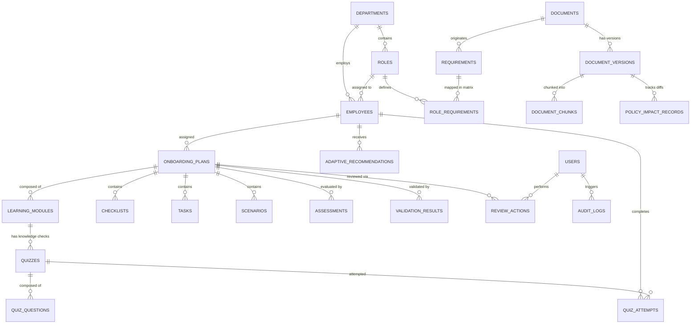

# SkillSprint AI: Database Schema & Data Dictionary

SkillSprint AI utilizes a normalized relational data model managed via **SQLAlchemy 2.0** on **SQLite** (compatible with PostgreSQL for cloud deployments). The database schema encompasses **24 normalized tables** designed to support enterprise-scale onboarding, document provenance, deterministic validation, review triage, and auditability.

---

## 1. Entity-Relationship Overview

---

## 2. Complete Data Dictionary (24 Tables)

### 2.1 Core Organizational Tables

#### `users`
System user accounts with role-based access control.
| Column | Type | Constraints | Description |
| :--- | :--- | :--- | :--- |
| `id` | INTEGER | PRIMARY KEY, AUTOINCREMENT | Unique user identifier |
| `username` | VARCHAR(100) | UNIQUE, NOT NULL | Login handle (e.g. admin, hr_lead) |
| `email` | VARCHAR(255) | UNIQUE, NOT NULL | Corporate email address |
| `hashed_password`| VARCHAR(255) | NOT NULL | Bcrypt password hash |
| `role` | VARCHAR(50) | NOT NULL, DEFAULT 'EMPLOYEE' | RBAC role: ADMIN, HR, MANAGER, EMPLOYEE |
| `is_active` | BOOLEAN | DEFAULT TRUE | Active account flag |
| `created_at` | DATETIME | DEFAULT utcnow | Account creation timestamp |

#### `departments`
Organizational units within ApexNova Global Technologies.
| Column | Type | Constraints | Description |
| :--- | :--- | :--- | :--- |
| `id` | INTEGER | PRIMARY KEY | Department ID |
| `name` | VARCHAR(100) | UNIQUE, NOT NULL | Department title (e.g. Cybersecurity) |
| `code` | VARCHAR(50) | UNIQUE, NOT NULL | Department code (e.g. DEPT-SEC) |
| `description` | TEXT | NULLABLE | Scope of operational mandate |

#### `roles`
Job roles and positions with experience tiers.
| Column | Type | Constraints | Description |
| :--- | :--- | :--- | :--- |
| `id` | INTEGER | PRIMARY KEY | Role ID |
| `code` | VARCHAR(50) | UNIQUE, NOT NULL | Role code (e.g. SEC_ANALYST, CUST_SUPPORT) |
| `name` | VARCHAR(100) | NOT NULL | Full role title |
| `department_id` | INTEGER | FOREIGN KEY (`departments.id`) | Assigned department |
| `experience_level`| VARCHAR(50) | DEFAULT 'Mid' | Junior, Mid, Senior, Lead |
| `description` | TEXT | NULLABLE | Core role responsibilities summary |

#### `employees`
Individual workforce member records tracked for onboarding.
| Column | Type | Constraints | Description |
| :--- | :--- | :--- | :--- |
| `id` | INTEGER | PRIMARY KEY | Employee ID |
| `employee_code` | VARCHAR(50) | UNIQUE, NOT NULL | Badge ID (e.g. EMP-001) |
| `full_name` | VARCHAR(100) | NOT NULL | Employee legal name |
| `role_id` | INTEGER | FOREIGN KEY (`roles.id`) | Assigned role |
| `department_id` | INTEGER | FOREIGN KEY (`departments.id`) | Assigned department |
| `hire_date` | DATETIME | NOT NULL | Employment start date |
| `experience_level`| VARCHAR(50) | DEFAULT 'Mid' | Baseline professional experience |
| `reporting_manager`| VARCHAR(100)| NULLABLE | Line manager name |
| `training_status`| VARCHAR(50) | DEFAULT 'Not Started' | Status: Behind Schedule, On Track, Completed |

---

### 2.2 Document Management & Knowledge Corpus

#### `documents`
Registered company policies, SOPs, FAQs, and handbooks.
| Column | Type | Constraints | Description |
| :--- | :--- | :--- | :--- |
| `id` | INTEGER | PRIMARY KEY | Document ID |
| `doc_code` | VARCHAR(50) | UNIQUE, NOT NULL | Reference code (e.g. DOC-POL-01) |
| `title` | VARCHAR(255) | NOT NULL | Document official title |
| `doc_type` | VARCHAR(50) | NOT NULL | POLICY, SOP, FAQ, HANDBOOK, GUIDANCE |
| `department_id` | INTEGER | FOREIGN KEY (`departments.id`) | Issuing department |
| `current_version`| VARCHAR(20) | DEFAULT '1.0' | Active version string |
| `file_path` | VARCHAR(500) | NOT NULL | Path on disk |
| `file_format` | VARCHAR(10) | NOT NULL | pdf, docx, txt, md |
| `checksum` | VARCHAR(64) | NOT NULL | SHA-256 integrity hash |
| `is_active` | BOOLEAN | DEFAULT TRUE | Active corporate validity |
| `is_flagged_adversarial` | BOOLEAN | DEFAULT FALSE | Security injection flag |

#### `document_versions`
Version history with precedence levels and effective dates.
| Column | Type | Constraints | Description |
| :--- | :--- | :--- | :--- |
| `id` | INTEGER | PRIMARY KEY | Version ID |
| `document_id` | INTEGER | FOREIGN KEY (`documents.id`) | Parent document |
| `version_str` | VARCHAR(20) | NOT NULL | Version identifier (e.g. 1.0, 2.0) |
| `effective_date`| DATETIME | NOT NULL | Date rule takes legal effect |
| `change_summary`| TEXT | NULLABLE | Description of policy delta |
| `is_active` | BOOLEAN | DEFAULT TRUE | Active flag |
| `precedence_level`| INTEGER | DEFAULT 1 | 1 (Policy), 2 (SOP), 3 (FAQ), 4 (Handbook) |

#### `document_chunks`
Granular text segments preserved with section and token counts.
| Column | Type | Constraints | Description |
| :--- | :--- | :--- | :--- |
| `id` | INTEGER | PRIMARY KEY | Chunk ID |
| `version_id` | INTEGER | FOREIGN KEY (`document_versions.id`) | Parent version |
| `chunk_index` | INTEGER | NOT NULL | Sequential chunk order |
| `section_id` | VARCHAR(50) | NOT NULL | Hierarchy ID (e.g. 1.2, 3.1.4) |
| `section_heading`| VARCHAR(255)| NOT NULL | Heading title |
| `page_number` | INTEGER | DEFAULT 1 | Source page number in PDF |
| `paragraph_ref`| VARCHAR(100)| NULLABLE | Paragraph index |
| `content` | TEXT | NOT NULL | Chunk text |
| `token_count` | INTEGER | NOT NULL | Estimated token count |

---

### 2.3 Requirements & Role Matrix

#### `requirements`
Identified compliance and operational requirements extracted from documents.
| Column | Type | Constraints | Description |
| :--- | :--- | :--- | :--- |
| `id` | INTEGER | PRIMARY KEY | Requirement ID |
| `req_code` | VARCHAR(50) | UNIQUE, NOT NULL | Standard code (e.g. REQ-SEC-001) |
| `document_id` | INTEGER | FOREIGN KEY (`documents.id`) | Originating document |
| `version_id` | INTEGER | FOREIGN KEY (`document_versions.id`) | Document version |
| `section_id` | VARCHAR(50) | NOT NULL | Section citation |
| `requirement_text`| TEXT | NOT NULL | Normative rule text |
| `category` | VARCHAR(50) | NOT NULL | KNOWLEDGE, TASK, SCENARIO, ASSESSMENT |
| `is_mandatory` | BOOLEAN | DEFAULT TRUE | Mandatory vs optional |
| `competency` | VARCHAR(100)| NOT NULL | High-level competency area |

#### `role_requirements`
The central Role Requirement Matrix mapping requirements to roles.
| Column | Type | Constraints | Description |
| :--- | :--- | :--- | :--- |
| `id` | INTEGER | PRIMARY KEY | Mapping ID |
| `role_id` | INTEGER | FOREIGN KEY (`roles.id`) | Target job role |
| `requirement_id`| INTEGER | FOREIGN KEY (`requirements.id`) | Mapped requirement |
| `is_mandatory` | BOOLEAN | DEFAULT TRUE | Mandatory for this specific role |
| `priority` | VARCHAR(20) | DEFAULT 'HIGH' | CRITICAL, HIGH, MEDIUM, LOW |
| `due_stage` | VARCHAR(50) | DEFAULT 'Day 1' | Day 1, Week 1, Week 2, 30, 60, 90 Days |
| `specific_instructions`| TEXT | NULLABLE | Role-tailored execution context |

---

### 2.4 Curriculum, Tasks, Scenarios & Quizzes

#### `onboarding_plans`
Synthesized onboarding journeys for individual employees.
| Column | Type | Constraints | Description |
| :--- | :--- | :--- | :--- |
| `id` | INTEGER | PRIMARY KEY | Plan ID |
| `employee_id` | INTEGER | FOREIGN KEY (`employees.id`) | Target employee |
| `role_id` | INTEGER | FOREIGN KEY (`roles.id`) | Role at generation time |
| `title` | VARCHAR(255) | NOT NULL | Plan title |
| `status` | VARCHAR(50) | DEFAULT 'DRAFT' | DRAFT, VERIFIED, INCOMPLETE, ACTIVE, ARCHIVED |
| `version` | INTEGER | DEFAULT 1 | Plan revision index |
| `created_at` | DATETIME | DEFAULT utcnow | Synthesis timestamp |

#### `learning_modules`
Pedagogical modules scheduled across onboarding stages.
| Column | Type | Constraints | Description |
| :--- | :--- | :--- | :--- |
| `id` | INTEGER | PRIMARY KEY | Module ID |
| `plan_id` | INTEGER | FOREIGN KEY (`onboarding_plans.id`) | Parent plan |
| `module_code` | VARCHAR(50) | NOT NULL | Module code (e.g. MOD-001) |
| `title` | VARCHAR(255) | NOT NULL | Module title |
| `category` | VARCHAR(50) | NOT NULL | KNOWLEDGE, TASK, SCENARIO |
| `purpose` | TEXT | NOT NULL | Learning rationale |
| `learning_objectives`| TEXT | DEFAULT '[]' | JSON list of objectives |
| `key_concepts`| TEXT | DEFAULT '[]' | JSON list of core terms |
| `estimated_duration_mins`| INTEGER | DEFAULT 45 | Pacing duration |
| `stage` | VARCHAR(50) | DEFAULT 'Week 1' | Day 1, Week 1, Week 2, 30, 60, 90 Days |
| `difficulty` | VARCHAR(50) | DEFAULT 'Beginner' | Beginner, Intermediate, Advanced |
| `source_doc_id`| VARCHAR(50) | NOT NULL | Cited document |
| `source_section_id`| VARCHAR(100)| NOT NULL | Cited section |
| `verification_status`| VARCHAR(50)| DEFAULT 'VERIFIED' | VERIFIED, OUTDATED_SOURCE, UNSUPPORTED |
| `status` | VARCHAR(50) | DEFAULT 'ASSIGNED' | ASSIGNED, IN_PROGRESS, COMPLETED |

#### `checklists`, `tasks`, `scenarios`, `quizzes`, `quiz_questions`, `quiz_attempts`, `assessments`, `prerequisites`
Normalized records governing interactive learner progress, question stems, distractors, evidence URLs, scoring attempts, and module dependency DAGs.

---

### 2.5 Validation, Auditing & Policy Impact

#### `validation_results`
Stores Pipeline 2 independent validation outputs and comparison matrices.
| Column | Type | Constraints | Description |
| :--- | :--- | :--- | :--- |
| `id` | INTEGER | PRIMARY KEY | Validation ID |
| `plan_id` | INTEGER | FOREIGN KEY (`onboarding_plans.id`) | Validated plan |
| `run_at` | DATETIME | DEFAULT utcnow | Timestamp |
| `coverage_score`| FLOAT | NOT NULL | Mandatory coverage % |
| `traceability_score`| FLOAT | NOT NULL | Active citation % |
| `consistency_score`| FLOAT | NOT NULL | Composite consistency index |
| `overall_status`| VARCHAR(50) | NOT NULL | VERIFIED, INCOMPLETE, etc. |
| `comparison_json`| TEXT | NOT NULL | 100+ row comparison matrix |

#### `review_actions`, `policy_impact_records`, `adaptive_recommendations`, `audit_logs`
Tables ensuring total human-in-the-loop auditability, version diff recording, automated learner remediation triggers, and immutable chronological action tracking.
